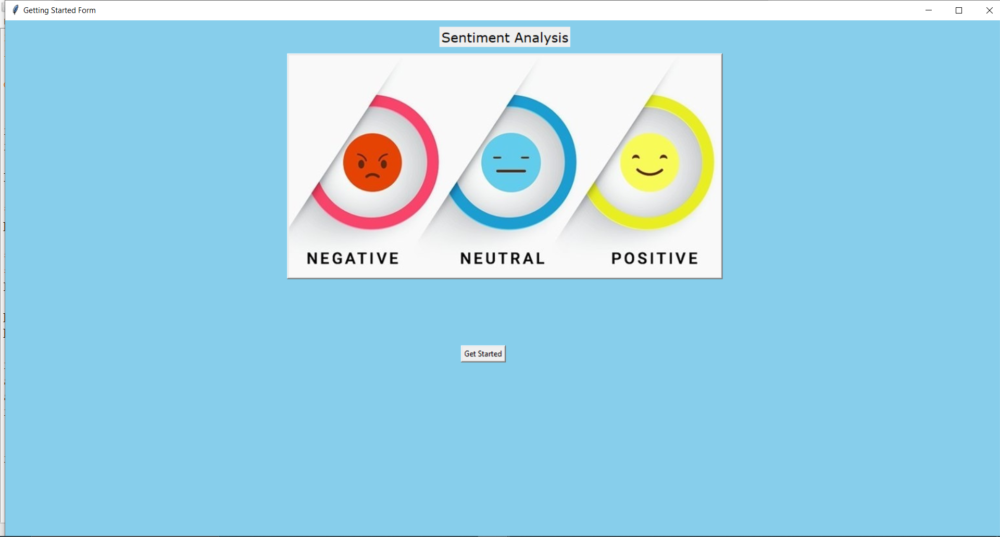
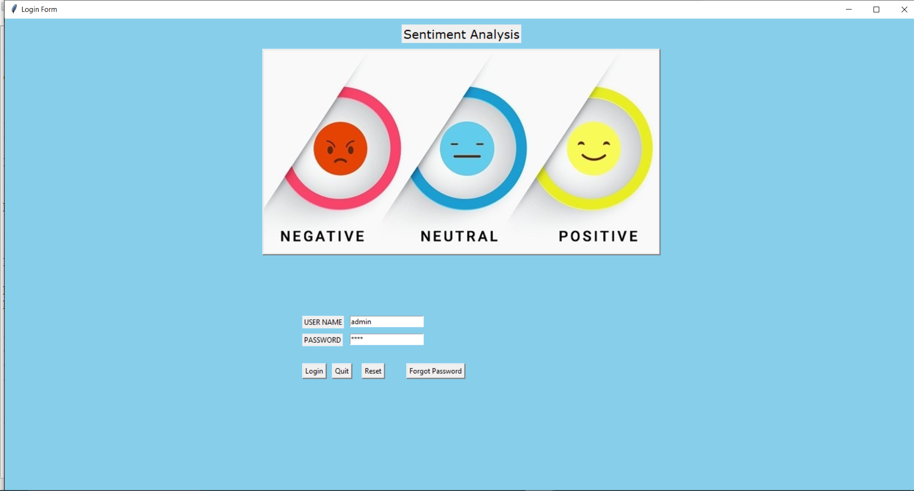
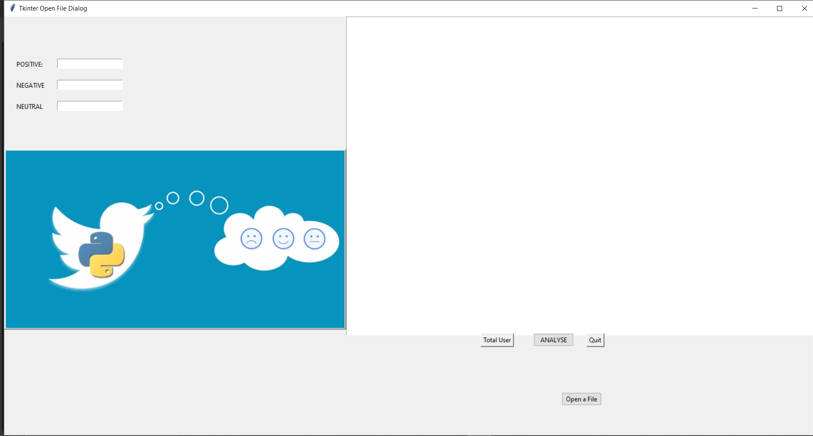
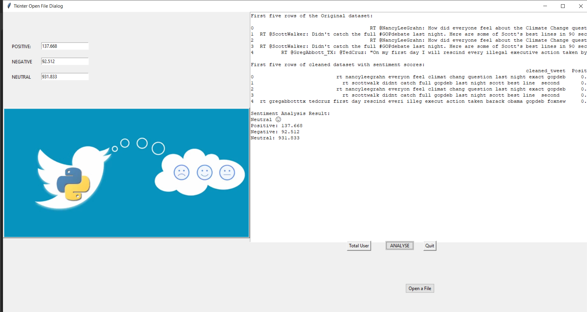
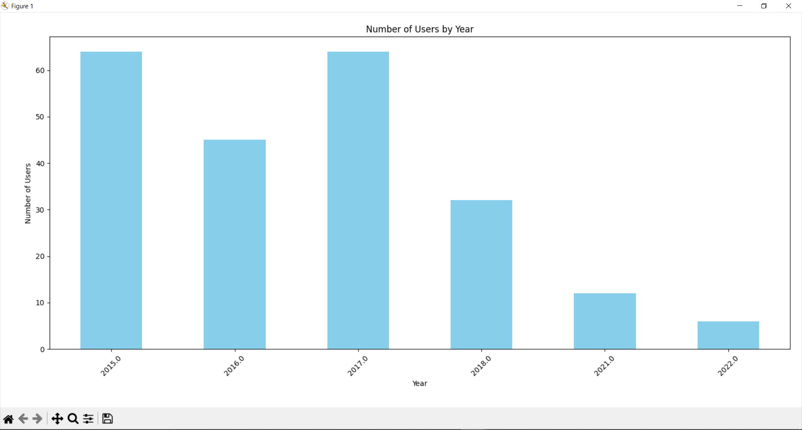

# 💬 Sentiment Analysis using Python (Tkinter + MySQL)



A **Machine Learning–based Sentiment Analysis Application** that classifies user sentiments from Twitter data as **Positive**, **Negative**, or **Neutral**.  
This project combines **Python**, **Tkinter GUI**, **MySQL Database**, and **Matplotlib Visualization** to deliver an end-to-end interactive sentiment analysis tool.

---

## 🌟 Features

✅ **User-Friendly GUI:** Built with Tkinter for easy navigation and interaction.  
✅ **Login & Authentication System:** Secure login for admin users connected to MySQL.  
✅ **Dataset Upload:** Browse and load `.csv` datasets directly from your system.  
✅ **Text Cleaning & Pre-processing:** Removes noise, handles case sensitivity, punctuation, and tokenization.  
✅ **Sentiment Classification:** Uses NLP to predict **Positive**, **Negative**, and **Neutral** sentiments.  
✅ **Statistical Analysis & Visualization:** Displays number of users by year and sentiment score distributions.  
✅ **Database Integration:** Stores and retrieves data using MySQL (via XAMPP).  

---

## 🧠 Technologies Used

| Category | Tools / Libraries |
|-----------|-------------------|
| **Programming Language** | Python 3.10+ |
| **GUI Framework** | Tkinter |
| **Database** | MySQL (via XAMPP) |
| **Machine Learning / NLP** | nltk, pandas, sklearn |
| **Visualization** | matplotlib |
| **IDE / Tools** | Visual Studio Code, Jupyter Notebook, IDLE |

---

## 🖼️ Application Interface

### 🏁 Getting Started Screen
The welcoming interface lets the user get started with sentiment analysis.


### 🔐 Login Form
Secure login form connected to MySQL for user verification.


### 📂 Dataset Upload and Display
Users can open a `.csv` file (e.g., tweets dataset). The data is then displayed for preview.


### 🧮 Analysis Result
After cleaning and analyzing, the GUI displays **sentiment score summaries**.


### 📊 Visualization
The sentiment and user data are visualized using **bar charts**.


---

## 📘 How It Works

1. **Load the Dataset**
   - Click **"Open File"** to browse and select a `.csv` file containing text or tweets.

2. **Pre-process the Data**
   - Text cleaning: tokenization, lowercasing, removing URLs, mentions, and special characters.

3. **Sentiment Calculation**
   - Each sentence is classified into one of three categories:  
     - 🟢 Positive  
     - 🔵 Neutral  
     - 🔴 Negative

4. **Result Display**
   - Displays positive, negative, and neutral scores in the GUI fields.

5. **Visualization**
   - Generates graphs such as “Number of Users by Year” using matplotlib.

6. **Database Connection**
   - Stores analysis logs and user data in a MySQL database through XAMPP.

---

## ⚙️ Installation & Setup

### 1. Clone the repository
```bash
git clone https://github.com/Ayesha-9/Sentiment-analysis-Project.git

### 2. Open XAMPP Control Panel

Start Apache and MySQL

Make sure MySQL is running on Port 3306 (or 3307 if changed)

3. Import Database

Open phpMyAdmin

Create a new database: sentiment_analysis

Import your SQL file (if provided)

4. Install required libraries
pip install pandas numpy matplotlib nltk scikit-learn mysql-connector-python

5. Run the application
python getstart.py

📊 Sample Output
Sentiment Analysis Result:
Neutral 🙂
Positive: 137.668
Negative: 92.512
Neutral: 931.833


And the GUI updates automatically with these values!

📈 Example Visualization

The bar chart below shows user counts by year.


📂 Project Structure
📦 Sentiment-analysis-Project
├── getstartf.py                  # Getting started page
├── loginpgf.py                # Login window logic
├── mainpg.py               # Main GUI file
├── FinalSentimentla.csv       # Dataset used
├── assets/                    # Screenshots and visualizations
├── README.md                  # Project documentation
└── requirements.txt           # Python dependencies

🧩 Real-World Application Scenarios

🐦 Social Media Monitoring: Analyze Twitter or Instagram sentiments about brands or products.

📰 Political Sentiment Tracking: Evaluate public opinion on policies or politicians.

💬 Customer Feedback Analysis: Understand customer satisfaction from survey responses or reviews.
